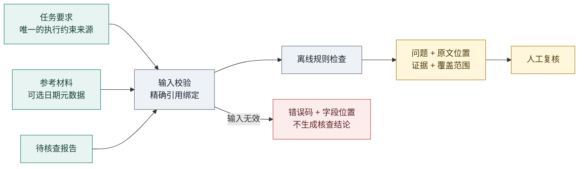
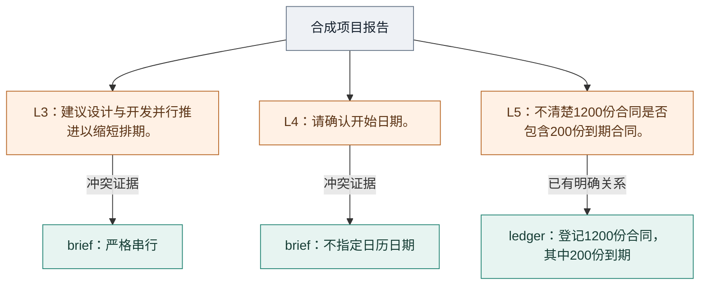

# Evidence-Bound Review

[中文](./README.md) | [English](./README_EN.md)

Evidence-Bound Review 是一个离线、零依赖的办公报告约束核查库和 CLI。它只根据调用方给出的任务要求、材料和引用关系，定位报告中的明确冲突，并为每个问题返回原文位置与证据。

## 为什么需要它

一份报告可以写得很流畅，却漏掉任务中的硬约束：把串行任务改成并行、再次追问材料已经说明的关系，或者把旧资料称作近期进展。人工复核时，最有用的不是另一个泛泛的“质量分数”，而是**哪句话有问题、与哪段材料冲突**。

Evidence-Bound Review 适合放在报告生成后的复核环节，也可以嵌入 Agent 工作流或本地脚本。相同输入得到相同结果；不需要模型密钥，不会把材料发送到外部服务。

典型用途：

- 任务明确要求串行，报告却建议并行推进。
- 材料已经说明包含关系，报告又将其列为未知。
- 用户排除了日历日期，报告仍把开始日期作为必要条件。
- 报告把窗口外或缺少发布日期依据的材料描述成“近期来源”。

它不是通用事实核查器。`no_findings` 只表示没有命中当前规则，返回值始终包含 `factVerification: "not_performed"`，不会把规则未命中包装成事实正确或质量通过。

## 工作原理



所有判断都限定在调用方提供的文本和显式元数据内。项目不会访问引用 URL，也不会把规则结果升级成外部事实认证。

## 快速开始

要求 Node.js 22 或更高版本。无需安装依赖、配置模型或启动服务。

```sh
git clone https://github.com/liulinlin718-netizen/evidence-bound-review.git
cd evidence-bound-review

node src/cli.js examples/project.json
node src/cli.js examples/sources.json --json
node src/cli.js --help
```

CLI 也接受标准输入：

```sh
node src/cli.js - --json
```

程序只读取指定的 JSON 文件或 stdin，不扫描目录、不访问来源 URL、不调用模型、不执行材料中的命令，也不改写报告。

## 看一个真实样例

[examples/project.json](./examples/project.json) 是仓库自带的公开合成材料，不含真实业务数据。运行上面的项目示例，会得到以下三个问题。下图按实际输出整理，是**结果示意图，不是应用截图**：



真实 CLI 输出节选：

```text
Evidence-Bound Review 0.2.0
发现 3 项给定材料范围内的问题；需要人工复核。
Fact verification: not_performed

[requirements.serial.parallel_action] 建议违反明确的串行约束
Report L3 [8, 25): 建议设计与开发并行推进以缩短排期。
Material brief L1 [49, 54): 严格串行，
```

`[8, 25)` 可以直接定位原报告片段。示例中的“研发负责人待定，需另行确认”没有被标成冲突：材料确实没有给出负责人。程序只指出已覆盖规则中的问题，不代替使用者补齐未知事实，也不会自动修改报告。

## 作为库使用

```js
import { reviewReport, dateWindow } from './src/index.js';

const result = reviewReport({
  requirements: {
    id: 'brief',
    text: '严格串行，不指定日历日期。研发负责人待定。',
  },
  report: '建议设计与开发并行推进。请确认开始日期。',
});

console.log(result.status);                    // issues_found
console.log(result.findings.map(item => item.ruleId));
console.log(result.findings[0].evidence[0]);
console.log(result.factVerification);          // not_performed
console.log(dateWindow('2026-09-18', 30));
```

公开 API：

| API | 作用 |
| --- | --- |
| `reviewReport(input)` | 核查报告与给定要求、材料和日期引用之间的明确冲突。 |
| `dateWindow(asOf, days?)` | 计算包含截止日的日历日闭区间。 |
| `ReviewInputError` / `errorEnvelope(error)` | 提供兼容 `TypeError` 的具名错误与安全的错误 JSON。 |
| `VERSION` / `RULESET` / `LIMITS` | 暴露版本化规则与输入限制。 |

ESM 导出和 TypeScript 类型声明位于 `src/index.js` 与 `src/index.d.ts`。

## 输入结构

```json
{
  "requirements": {
    "id": "brief",
    "text": "严格串行，不指定日历日期。"
  },
  "materials": [
    {
      "id": "source-1",
      "text": "发布日期：2026-09-16。合成资料。",
      "source": {
        "url": "https://example.org/synthetic",
        "basis": "publication",
        "publicationDate": "2026-09-16",
        "dateQuote": "发布日期：2026-09-16"
      }
    }
  ],
  "report": "这份材料用作近期进展参考。",
  "temporal": {
    "asOf": "2026-09-18",
    "days": 30
  },
  "citations": [
    {
      "materialId": "source-1",
      "reportQuote": "这份材料用作近期进展参考。",
      "usage": "recent"
    }
  ]
}
```

字段含义：

| 字段 | 说明 |
| --- | --- |
| `requirements` | 必填。只有这里的明确指令能建立串行、日历等任务约束。 |
| `materials` | 可选参考材料；材料不能覆盖任务权限或要求。 |
| `report` | 必填待核查文本；库不会修改或润色它。 |
| `temporal` | 日期核查参数；必须显式提供 `asOf`，不读取机器“今天”。 |
| `citations` | 调用方声明的报告片段与材料绑定，不自动猜测链接用途。 |

材料 ID 必须唯一。未知字段、无效的调研窗口日期、重复且未消歧的引用、错误偏移和不匹配原文会被拒绝，避免输入错误被误判为核查通过。来源发布日期缺失或无效则标记为 `unverified`，不会自动补日期。

## 日期与引用

`source.url` 只作为元数据，程序永不访问。近期日期只有在以下条件同时满足时才可用：

- `basis` 为 `publication`
- `publicationDate` 是有效 ISO 日期
- `dateQuote` 精确存在于材料正文并包含该日期
- `reportQuote` 精确存在于报告
- 引用显式声明 `usage: "recent"`

更新日期、URL 中的日期和正文里的普通日期不会自动升级为发布日期。窗口外来源可以用 `usage: "background"` 表示背景材料，但这仍不证明材料真实或支持报告结论。

文本位置采用 JavaScript 原始字符串的 UTF-16、零起点、右端不包含区间 `[start, end)`，可直接用于 `text.slice(start, end)`。

## 规则

| 规则 ID | 核查内容 |
| --- | --- |
| `requirements.serial.parallel_action` | 严格串行要求下出现直接并行建议。 |
| `requirements.serial.redundant_question` | 已明确的串行条件又被当成未决问题。 |
| `requirements.calendar.excluded` | 已排除日历日期，却把具体起算日期列为必要条件或风险。 |
| `material.subset.already_explicit` | 已明确的“其中/内含/含有”关系又被列为未知。 |
| `sources.date.unverified` | 近期引用缺少合格发布日期或原文绑定。 |
| `sources.date.future` | 发布日期晚于调研截止日。 |
| `sources.date.outside_window` | 发布日期早于近期窗口。 |

每个 finding 包含稳定规则 ID、问题原因、报告位置和材料证据。`coverage` 会列出实际启用的规则和因歧义而跳过的检查。

### 如何理解结果

`status: "issues_found"` 表示找到需要复核的问题；`status: "no_findings"` 仅表示未命中覆盖范围内的规则。`factVerification` 始终是 `not_performed`。调用方应同时查看 `findings` 和 `coverage.skipped`，不能把没有问题或跳过检查解释为全文通过。

串行/日历检查使用保留原文偏移的子句范围；跨逗号的条件分支保守继承，无法确定时记录跳过原因，不做通用语义推理。每条引用都可用原字符串的 `slice(start, end)` 重现。

包含关系先用明确单位和完整来源标签收窄候选，再判断歧义。正整数以十进制字符串精确比较，最多支持 64 位（含前导零）；超长数量记录跳过原因，不舍入后匹配，也不做算术核查。

完全重复的日期绑定按 `materialId + report.start/end + usage` 合并，`sources` 每个唯一绑定一条；`coverage.explicitDateCitations` 是原始条数，`uniqueDateCitations` 是唯一绑定数，`assessedDateSources` 是实际评估的材料数。文本索引和评估缓存仅存在于单次调用内。

## CLI 退出码

| 退出码 | 含义 |
| --- | --- |
| `0` | 未命中已覆盖规则，仍未进行通用事实验证。 |
| `1` | 找到问题，需要人工复核。 |
| `2` | 参数、UTF-8、JSON、输入大小或引用绑定无效。 |

`--json` 失败时，stdout 为空，stderr 输出以下版本化结构，退出码仍为 `2`：

```json
{
  "schema": "evidence-bound-review/error-v1",
  "error": {
    "code": "quote_not_found",
    "path": "/materials/1/source/dateQuote",
    "message": "Quote must be an exact substring at the supplied offset."
  }
}
```

`path` 是输入的 JSON Pointer，空字符串表示根节点，不含本机路径或原文。常用 `code` 包括 `input_not_readable`、`invalid_json`、`invalid_utf8`、`limit_exceeded`、`quote_not_found`、`quote_ambiguous`。完整类型见 `src/index.d.ts`；库错误仍满足 `error instanceof TypeError`。离线接入样例：`node examples/handle-review-error.mjs`。

## 适用边界

- 不访问外部来源，不验证网页真实性或发布日期真伪。
- 不做全文事实验证、算术复算、通用指令遵循评分或模型评测。
- 规则主要覆盖有限中文办公措辞，不承担完整自然语言推理。
- 不推导不同材料中的集合身份、统计口径或现实因果关系。
- 不应作为唯一自动放行门槛；适合提示人工复核或拦截已知冲突。
- 调用方必须安全转义返回原文，不能直接拼接为可信 HTML。

默认限制包括单段文本 100,000 个 UTF-16 单元、合计 250,000、32 份材料、128 条原始引用、每段文本 2,000 个正文语句、200 个包含关系和 2,000 个唯一问题（含日期问题）。这些限制由 `LIMITS` 导出，超限会显式报错，不截断后声称完成核查。64 位数量边界是规则覆盖限制，超出后在 `coverage.skipped` 说明。

## 测试

```sh
node --test
```

测试全部使用合成、本地数据。

## 许可

MIT。该项目从 TAgent 的材料约束、日期窗口和精确引用机制中提取，并重写为独立 ESM。来源说明见 [NOTICE](./NOTICE)。
