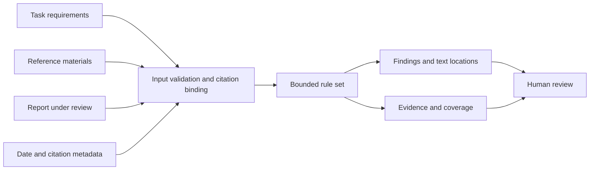

# Evidence-Bound Review

[中文](./README.md) | [English](./README_EN.md)

Evidence-Bound Review is an offline, zero-dependency library and CLI for checking narrow office-report constraints. It uses only the requirements, materials, and citation relationships supplied by the caller, and returns each explicit conflict with its text location and supporting evidence.

Typical uses include:

- A task requires strictly sequential work, but the report recommends parallel execution.
- Supplied material already states a containment relationship, but the report lists it as unknown.
- The user excludes calendar dates, but the report treats a start date as required.
- The report calls a source “recent” even though its date is outside the requested window or lacks publication-date evidence.

This project is not a general fact checker. `no_findings` means only that no enabled rule matched. Every result includes `factVerification: "not_performed"`; a rule miss is never presented as factual correctness or overall quality approval.

## How It Works



Every decision is bounded by caller-supplied text and explicit metadata. The project never visits cited URLs and never upgrades rule output into external fact certification.

## Quick Start

Requires Node.js 22 or newer. No dependency installation, model configuration, or service startup is required.

```bash
git clone https://github.com/liulinlin718-netizen/evidence-bound-review.git
cd evidence-bound-review

node src/cli.js examples/project.json
node src/cli.js examples/sources.json --json
node src/cli.js --help
```

The CLI also accepts standard input:

```bash
node src/cli.js - --json
```

It reads only the specified JSON file or stdin. It does not scan directories, visit source URLs, call a model, execute commands found in materials, or rewrite the report.

## Library Usage

```js
import { reviewReport, dateWindow } from './src/index.js';

const result = reviewReport({
  requirements: {
    id: 'brief',
    text: '严格串行，不指定日历日期。',
  },
  report: '建议设计与开发并行推进。请确认开始日期。',
});

console.log(result.status);                    // issues_found
console.log(result.findings.map(item => item.ruleId));
console.log(result.findings[0].evidence[0]);
console.log(result.factVerification);          // not_performed
console.log(dateWindow('2026-09-18', 30));
```

Public API:

| API | Purpose |
| --- | --- |
| `reviewReport(input)` | Check explicit conflicts between a report and supplied requirements, materials, and date citations. |
| `dateWindow(asOf, days?)` | Calculate an inclusive calendar-day window ending on `asOf`. |
| `VERSION` / `RULESET` / `LIMITS` | Expose the versioned rules and input bounds. |

ESM exports and TypeScript declarations are provided by `src/index.js` and `src/index.d.ts`.

## Input Shape

```json
{
  "requirements": {
    "id": "brief",
    "text": "Work strictly in sequence. Do not require a calendar date."
  },
  "materials": [
    {
      "id": "source-1",
      "text": "Published: 2026-09-16. Synthetic material.",
      "source": {
        "url": "https://example.org/synthetic",
        "basis": "publication",
        "publicationDate": "2026-09-16",
        "dateQuote": "Published: 2026-09-16"
      }
    }
  ],
  "report": "This material is used as a recent-development reference.",
  "temporal": {
    "asOf": "2026-09-18",
    "days": 30
  },
  "citations": [
    {
      "materialId": "source-1",
      "reportQuote": "This material is used as a recent-development reference.",
      "usage": "recent"
    }
  ]
}
```

| Field | Meaning |
| --- | --- |
| `requirements` | Required. Only explicit instructions here establish serial-work, calendar, and similar task constraints. |
| `materials` | Optional references; materials cannot override task permissions or requirements. |
| `report` | Required text under review; the library never edits or rewrites it. |
| `temporal` | Date-review parameters; `asOf` must be explicit, so machine “today” is never used. |
| `citations` | Caller-declared bindings between report fragments and materials; usage is never guessed from a URL. |

Material IDs must be unique. Unknown fields, invalid dates, unresolved duplicate quotations, incorrect offsets, and quotation mismatches are rejected so malformed input cannot be mistaken for a passing review.

## Dates and Citations

`source.url` is metadata only and is never fetched. A date can support a recent-source claim only when all of these conditions hold:

- `basis` is `publication`
- `publicationDate` is a valid ISO date
- `dateQuote` appears exactly in the material and contains that date
- `reportQuote` appears exactly in the report
- the citation declares `usage: "recent"`

Update dates, dates embedded in URLs, and ordinary dates in body text are not promoted automatically to publication dates. An out-of-window source may be marked `usage: "background"`, but that still does not prove the source is genuine or supports the report's conclusions.

Text locations use zero-based, end-exclusive UTF-16 ranges over the original JavaScript string: `[start, end)`. They can be passed directly to `text.slice(start, end)`.

## Rules

| Rule ID | What It Checks |
| --- | --- |
| `requirements.serial.parallel_action` | A direct parallel-work recommendation under a strict sequential requirement. |
| `requirements.serial.redundant_question` | A settled sequential constraint is asked again as an open question. |
| `requirements.calendar.excluded` | A concrete start date is made necessary even though calendar dates were excluded. |
| `material.subset.already_explicit` | An explicit containment relationship is reported as unknown. |
| `sources.date.unverified` | A recent-source citation lacks qualified publication-date evidence or exact text binding. |
| `sources.date.future` | A publication date is later than the research cutoff. |
| `sources.date.outside_window` | A publication date falls before the recent-source window. |

Each finding includes a stable rule ID, explanation, report location, and material evidence. `coverage` lists the rules actually enabled and checks skipped because of ambiguity.

## CLI Exit Codes

| Code | Meaning |
| --- | --- |
| `0` | No covered rule matched; general fact verification was still not performed. |
| `1` | Findings require human review. |
| `2` | Invalid arguments, UTF-8, JSON, input size, or citation binding. |

## Scope and Limits

- Does not visit external sources or verify web authenticity and publication dates.
- Does not perform full-text fact checking, arithmetic verification, general instruction scoring, or model evaluation.
- Rules cover a limited vocabulary of office-report constraints rather than unrestricted natural-language reasoning.
- Does not infer entity identity, statistical methodology, or real-world causality across materials.
- Should support human review, not serve as the only automatic release gate.
- Callers must escape returned source text safely and never inject it as trusted HTML.

Default limits include 100,000 UTF-16 units per text, 250,000 combined, 32 materials, and 128 citations. Excess input is rejected explicitly rather than truncated and reported as reviewed.

## Tests and Contributing

```bash
node --test
```

Tests use synthetic local data only. Reproducible reports and narrowly scoped rule proposals are welcome in [Issues](https://github.com/liulinlin718-netizen/evidence-bound-review/issues). New rules should remain explainable, evidence-linked, and covered by positive and negative fixtures.

## License

[MIT License](./LICENSE). The project was extracted from TAgent's material-constraint, date-window, and exact-citation mechanisms and rewritten as a standalone ESM package. See [NOTICE](./NOTICE) for provenance.
