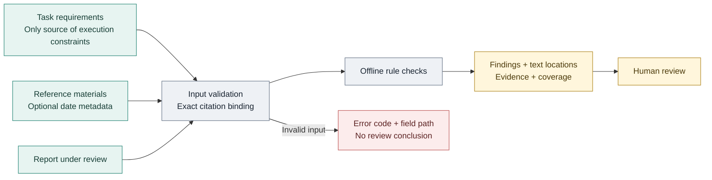
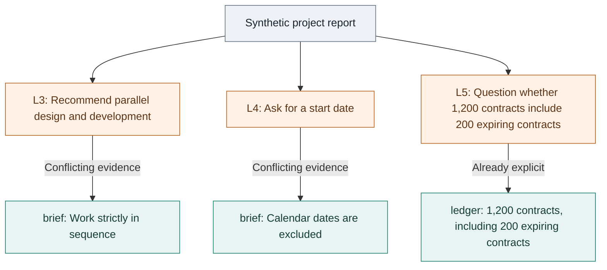

# Evidence-Bound Review

[中文](./README.md) | [English](./README_EN.md)

Evidence-Bound Review is an offline, zero-dependency library and CLI for checking narrow office-report constraints. It uses only the requirements, materials, and citation relationships supplied by the caller, and returns each explicit conflict with its text location and supporting evidence.

## Why It Exists

A fluent report can still overlook a hard constraint: turn sequential work into parallel work, reopen a relationship already stated in the material, or describe an old source as recent. For a reviewer, the useful question is not another general quality score. It is **which statement conflicts with which piece of supplied evidence**.

Use Evidence-Bound Review after report generation, inside an Agent workflow, or in a local script. The same input produces the same result. No model key is required, and no material is sent to an external service.

Typical uses include:

- A task requires strictly sequential work, but the report recommends parallel execution.
- Supplied material already states a containment relationship, but the report lists it as unknown.
- The user excludes calendar dates, but the report treats a start date as required.
- The report calls a source “recent” even though its date is outside the requested window or lacks publication-date evidence.

This project is not a general fact checker. `no_findings` means only that no enabled rule matched. Every result includes `factVerification: "not_performed"`; a rule miss is never presented as factual correctness or overall quality approval.

## How It Works



Every decision is bounded by caller-supplied text and explicit metadata. The project never visits cited URLs and never upgrades rule output into external fact certification.

## Quick Start

Requires Node.js 22 or newer. No dependency installation, model configuration, or service startup is required.

```bash
git clone https://github.com/liulinlin718-netizen/evidence-bound-review.git
cd evidence-bound-review

node src/cli.js examples/project.json
node src/cli.js examples/sources.json --json
node src/cli.js --help
```

The CLI also accepts standard input:

```bash
node src/cli.js - --json
```

It reads only the specified JSON file or stdin. It does not scan directories, visit source URLs, call a model, execute commands found in materials, or rewrite the report.

## See a Real Example

[examples/project.json](./examples/project.json) is a public synthetic fixture included in this repository, not real business data. Running the project example produces three findings. This diagram is a **visual summary of the actual result, not an application screenshot**. The English labels translate the Chinese fixture; they do not imply support for English semantic checks.



Excerpt from the actual CLI output, with the original Chinese text preserved:

```text
Evidence-Bound Review 0.2.0
发现 3 项给定材料范围内的问题；需要人工复核。
Fact verification: not_performed

[requirements.serial.parallel_action] 建议违反明确的串行约束
Report L3 [8, 25): 建议设计与开发并行推进以缩短排期。
Material brief L1 [49, 54): 严格串行，
```

The range `[8, 25)` locates the original report excerpt. The fixture's statement that the development owner remains undecided is not flagged: the material really does leave that person unspecified. The tool identifies covered conflicts, not missing facts, and never rewrites the report.

## Library Usage

```js
import { reviewReport, dateWindow } from './src/index.js';

const result = reviewReport({
  requirements: {
    id: 'brief',
    text: '严格串行，不指定日历日期。',
  },
  report: '建议设计与开发并行推进。请确认开始日期。',
});

console.log(result.status);                    // issues_found
console.log(result.findings.map(item => item.ruleId));
console.log(result.findings[0].evidence[0]);
console.log(result.factVerification);          // not_performed
console.log(dateWindow('2026-09-18', 30));
```

Public API:

| API | Purpose |
| --- | --- |
| `reviewReport(input)` | Check explicit conflicts between a report and supplied requirements, materials, and date citations. |
| `dateWindow(asOf, days?)` | Calculate an inclusive calendar-day window ending on `asOf`. |
| `ReviewInputError` / `errorEnvelope(error)` | Provide a named `TypeError` subclass and a safe error JSON envelope. |
| `VERSION` / `RULESET` / `LIMITS` | Expose the versioned rules and input bounds. |

ESM exports and TypeScript declarations are provided by `src/index.js` and `src/index.d.ts`.

## Input Shape

```json
{
  "requirements": {
    "id": "brief",
    "text": "Work strictly in sequence. Do not require a calendar date."
  },
  "materials": [
    {
      "id": "source-1",
      "text": "Published: 2026-09-16. Synthetic material.",
      "source": {
        "url": "https://example.org/synthetic",
        "basis": "publication",
        "publicationDate": "2026-09-16",
        "dateQuote": "Published: 2026-09-16"
      }
    }
  ],
  "report": "This material is used as a recent-development reference.",
  "temporal": {
    "asOf": "2026-09-18",
    "days": 30
  },
  "citations": [
    {
      "materialId": "source-1",
      "reportQuote": "This material is used as a recent-development reference.",
      "usage": "recent"
    }
  ]
}
```

| Field | Meaning |
| --- | --- |
| `requirements` | Required. Only explicit instructions here establish serial-work, calendar, and similar task constraints. |
| `materials` | Optional references; materials cannot override task permissions or requirements. |
| `report` | Required text under review; the library never edits or rewrites it. |
| `temporal` | Date-review parameters; `asOf` must be explicit, so machine “today” is never used. |
| `citations` | Caller-declared bindings between report fragments and materials; usage is never guessed from a URL. |

Material IDs must be unique. Unknown fields, invalid review-window dates, unresolved duplicate quotations, incorrect offsets, and quotation mismatches are rejected so malformed input cannot be mistaken for a passing review. Missing or invalid source publication dates are assessed as `unverified`, never filled in automatically.

## Dates and Citations

`source.url` is metadata only and is never fetched. A date can support a recent-source claim only when all of these conditions hold:

- `basis` is `publication`
- `publicationDate` is a valid ISO date
- `dateQuote` appears exactly in the material and contains that date
- `reportQuote` appears exactly in the report
- the citation declares `usage: "recent"`

Update dates, dates embedded in URLs, and ordinary dates in body text are not promoted automatically to publication dates. An out-of-window source may be marked `usage: "background"`, but that still does not prove the source is genuine or supports the report's conclusions.

Text locations use zero-based, end-exclusive UTF-16 ranges over the original JavaScript string: `[start, end)`. They can be passed directly to `text.slice(start, end)`.

## Rules

| Rule ID | What It Checks |
| --- | --- |
| `requirements.serial.parallel_action` | A direct parallel-work recommendation under a strict sequential requirement. |
| `requirements.serial.redundant_question` | A settled sequential constraint is asked again as an open question. |
| `requirements.calendar.excluded` | A concrete start date is made necessary even though calendar dates were excluded. |
| `material.subset.already_explicit` | An explicit containment relationship is reported as unknown. |
| `sources.date.unverified` | A recent-source citation lacks qualified publication-date evidence or exact text binding. |
| `sources.date.future` | A publication date is later than the research cutoff. |
| `sources.date.outside_window` | A publication date falls before the recent-source window. |

Each finding includes a stable rule ID, explanation, report location, and material evidence. `coverage` lists the rules actually enabled and checks skipped because of ambiguity.

### Reading the Result

`status: "issues_found"` means findings need review; `status: "no_findings"` means only that no covered rule matched. `factVerification` is always `not_performed`. Read both `findings` and `coverage.skipped`; neither a rule miss nor a skipped check means the entire report passed.

Serial/calendar checks use clauses with original offsets. Conditional branches are conservatively inherited across commas; uncertain scope is recorded as skipped rather than interpreted by general semantic reasoning. Every reference can be reproduced with `slice(start, end)` on the original string.

Containment candidates are narrowed by explicit units and complete source labels before ambiguity is assessed. Positive integers are compared as exact decimal strings, with a 64-digit limit including leading zeros. Oversized quantities are recorded as skipped, not rounded or used for arithmetic verification.

Identical date bindings are deduplicated by `materialId + report.start/end + usage`; `sources` has one entry per unique binding. `coverage.explicitDateCitations` counts raw citations, `uniqueDateCitations` counts unique bindings, and `assessedDateSources` counts assessed materials. Text indexes and assessment caches live only for the current call.

## CLI Exit Codes

| Code | Meaning |
| --- | --- |
| `0` | No covered rule matched; general fact verification was still not performed. |
| `1` | Findings require human review. |
| `2` | Invalid arguments, UTF-8, JSON, input size, or citation binding. |

On failure with `--json`, stdout stays empty, stderr contains this versioned envelope, and the exit code remains `2`:

```json
{
  "schema": "evidence-bound-review/error-v1",
  "error": {
    "code": "quote_not_found",
    "path": "/materials/1/source/dateQuote",
    "message": "Quote must be an exact substring at the supplied offset."
  }
}
```

`path` is a JSON Pointer into the input; an empty string denotes the root. Diagnostics do not include OS paths or input excerpts. Common codes include `input_not_readable`, `invalid_json`, `invalid_utf8`, `limit_exceeded`, `quote_not_found`, and `quote_ambiguous`. See `src/index.d.ts` for the full type union. Library errors still satisfy `error instanceof TypeError`. Run the offline integration example with `node examples/handle-review-error.mjs`.

## Scope and Limits

- Does not visit external sources or verify web authenticity and publication dates.
- Does not perform full-text fact checking, arithmetic verification, general instruction scoring, or model evaluation.
- Rules cover a limited vocabulary of office-report constraints rather than unrestricted natural-language reasoning.
- Does not infer entity identity, statistical methodology, or real-world causality across materials.
- Should support human review, not serve as the only automatic release gate.
- Callers must escape returned source text safely and never inject it as trusted HTML.

Default limits include 100,000 UTF-16 units per text, 250,000 combined, 32 materials, 128 raw citations, 2,000 prose statements per text, 200 containment relations, and 2,000 unique findings including date findings. These bounds are exported in `LIMITS`. Excess input is rejected explicitly rather than truncated and reported as reviewed. The 64-digit quantity bound is a rule-coverage limit; exceeding it is explained in `coverage.skipped`.

## Tests and Contributing

```bash
node --test
```

Tests use synthetic local data only. Reproducible reports and narrowly scoped rule proposals are welcome in [Issues](https://github.com/liulinlin718-netizen/evidence-bound-review/issues). New rules should remain explainable, evidence-linked, and covered by positive and negative fixtures.

## License

[MIT License](./LICENSE). The project was extracted from TAgent's material-constraint, date-window, and exact-citation mechanisms and rewritten as a standalone ESM package. See [NOTICE](./NOTICE) for provenance.
